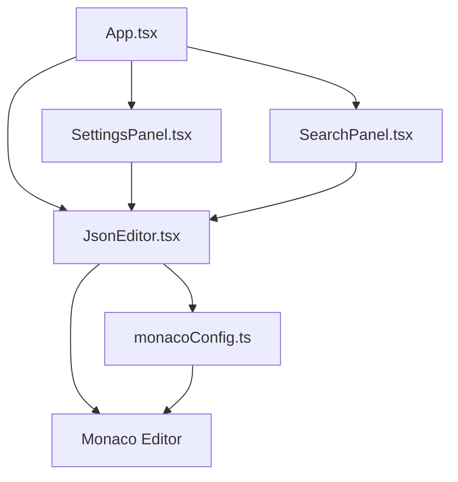

# Design Document: Monaco Editor 改进

## Overview

本设计文档详细说明了如何改进PDX JSON Editor项目中Monaco Editor的使用。设计目标是解决当前存在的问题，包括缩略图显示不稳定、搜索替换功能不可靠、类型安全性不足，以及未充分利用Monaco Editor的高级功能。通过这些改进，我们将提高编辑器的稳定性、性能和用户体验。

## Architecture

项目将保持现有的整体架构，但对Monaco Editor的集成和使用方式进行优化。主要组件关系如下：



## Components and Interfaces

### 1. Monaco Editor 配置模块 (monacoConfig.ts)

重新设计Monaco配置模块，移除直接DOM操作，使用标准API：

```typescript
// 新的Monaco配置接口
export interface MonacoConfigOptions {
  theme: 'light' | 'dark';
  minimap: boolean;
  wordWrap: boolean;
  lineNumbers: boolean;
  indentSize: 2 | 4;
  indentType: 'spaces' | 'tabs';
  schemas?: Array<{
    uri: string;
    fileMatch?: string[];
    schema: any;
  }>;
}

// 配置Monaco编辑器的函数
export function configureMonaco(monaco: any): void {
  // 配置JSON语言支持
  // 注册自定义主题
  // 设置默认选项
}

// 应用编辑器选项的函数
export function applyEditorOptions(
  editor: monaco.editor.IStandaloneCodeEditor,
  options: MonacoConfigOptions
): void {
  // 使用Monaco API应用选项
}

// 注册JSON Schema的函数
export function registerJsonSchema(
  monaco: any,
  schemas: Array<{ uri: string; fileMatch?: string[]; schema: any }>
): void {
  // 注册JSON Schema
}
```

### 2. JsonEditor 组件 (JsonEditor.tsx)

重构JsonEditor组件，提高类型安全性和功能可靠性：

```typescript
import { useRef, useEffect, useImperativeHandle, forwardRef } from 'react';
import Editor, { Monaco, OnMount } from '@monaco-editor/react';
import * as monaco from 'monaco-editor';
import { MonacoConfigOptions, applyEditorOptions } from '../../utils/monacoConfig';
import { EditorMethods, MonacoEditorProps } from '../../types/editor.types';

const JsonEditor = forwardRef<EditorMethods, MonacoEditorProps>((props, ref) => {
  // 使用正确的类型定义
  const editorRef = useRef<monaco.editor.IStandaloneCodeEditor | null>(null);
  const monacoRef = useRef<Monaco | null>(null);
  
  // 编辑器挂载处理
  const handleEditorDidMount: OnMount = (editor, monaco) => {
    // 使用正确的类型
    editorRef.current = editor;
    monacoRef.current = monaco;
    
    // 配置编辑器...
  };
  
  // 暴露方法给父组件
  useImperativeHandle(ref, () => ({
    // 实现编辑器方法...
  }));
  
  // 返回编辑器组件
  return (
    <Editor
      // 配置编辑器属性...
    />
  );
});
```

### 3. 编辑器类型定义 (editor.types.ts)

增强类型定义，使用Monaco提供的接口：

```typescript
import * as monaco from 'monaco-editor';

// 编辑器方法接口
export interface EditorMethods {
  formatDocument: () => void;
  undo: () => void;
  redo: () => void;
  selectAll: () => void;
  find: () => void;
  replace: () => void;
  gotoLine: (line: number, column?: number) => void;
  getSelection: () => monaco.Selection | null;
  getSelectedText: () => string;
  insertText: (text: string) => void;
  canUndo: () => boolean;
  canRedo: () => boolean;
  focus: () => void;
  getEditor: () => monaco.editor.IStandaloneCodeEditor;
  getMonaco: () => typeof monaco;
  // 新增方法
  toggleFolding: () => void;
  showDiffEditor: (originalContent: string) => void;
}

// 其他类型定义...
```

### 4. 搜索和替换功能

重新设计搜索和替换功能，使用Monaco标准API：

```typescript
// 在JsonEditor组件中
const find = useCallback(() => {
  if (editorRef.current) {
    // 使用标准API
    const action = editorRef.current.getAction('actions.find');
    if (action) {
      action.run();
    }
  }
}, []);

const replace = useCallback(() => {
  if (editorRef.current) {
    // 使用标准API
    const action = editorRef.current.getAction('editor.action.startFindReplaceAction');
    if (action) {
      action.run();
    }
  }
}, []);
```

### 5. 高级功能实现

#### 5.1 代码折叠

```typescript
// 在JsonEditor组件中
const toggleFolding = useCallback(() => {
  if (editorRef.current) {
    const action = editorRef.current.getAction('editor.foldAll') || 
                  editorRef.current.getAction('editor.unfoldAll');
    if (action) {
      action.run();
    }
  }
}, []);

// 添加折叠控制UI
const FoldingControls = () => (
  <div className="folding-controls">
    <button onClick={() => editorRef.current?.getAction('editor.foldAll')?.run()}>
      折叠全部
    </button>
    <button onClick={() => editorRef.current?.getAction('editor.unfoldAll')?.run()}>
      展开全部
    </button>
  </div>
);
```

#### 5.2 JSON Schema 支持

```typescript
// 在monacoConfig.ts中
export function registerJsonSchema(monaco: any, schemas: any[]): void {
  monaco.languages.json.jsonDefaults.setDiagnosticsOptions({
    validate: true,
    schemas: schemas.map(schema => ({
      uri: schema.uri,
      fileMatch: schema.fileMatch || ['*'],
      schema: schema.schema
    }))
  });
}

// 在App.tsx中使用
useEffect(() => {
  if (monacoRef.current) {
    registerJsonSchema(monacoRef.current, [
      {
        uri: 'http://myserver/schema.json',
        fileMatch: ['*.json'],
        schema: {
          type: 'object',
          properties: {
            // 定义JSON Schema
          }
        }
      }
    ]);
  }
}, [monacoRef.current]);
```

#### 5.3 差异编辑器

```typescript
// 在JsonEditor组件中
const showDiffEditor = useCallback((originalContent: string) => {
  if (monacoRef.current && editorRef.current) {
    // 创建原始模型
    const originalModel = monacoRef.current.editor.createModel(
      originalContent,
      'json'
    );
    
    // 获取当前模型
    const modifiedModel = editorRef.current.getModel();
    
    // 创建差异编辑器
    const diffEditor = monacoRef.current.editor.createDiffEditor(
      document.getElementById('diff-container') as HTMLElement,
      {
        automaticLayout: true,
        readOnly: false
      }
    );
    
    // 设置模型
    diffEditor.setModel({
      original: originalModel,
      modified: modifiedModel
    });
  }
}, []);
```

#### 5.4 悬停提示和链接检测

```typescript
// 在handleEditorDidMount中
monaco.languages.registerHoverProvider('json', {
  provideHover: (model, position) => {
    // 获取当前位置的单词
    const word = model.getWordAtPosition(position);
    if (!word) return null;
    
    // 提供悬停信息
    return {
      contents: [
        { value: `**${word.word}**` },
        { value: '这是关于此字段的说明...' }
      ]
    };
  }
});

// 链接检测
monaco.languages.registerLinkProvider('json', {
  provideLinks: (model) => {
    const links = [];
    const regex = /"(https?:\/\/[^\s"]+)"/g;
    const text = model.getValue();
    let match;
    
    while ((match = regex.exec(text)) !== null) {
      const startPos = model.getPositionAt(match.index + 1);
      const endPos = model.getPositionAt(match.index + match[1].length + 1);
      links.push({
        range: {
          startLineNumber: startPos.lineNumber,
          startColumn: startPos.column,
          endLineNumber: endPos.lineNumber,
          endColumn: endPos.column
        },
        url: match[1]
      });
    }
    
    return { links };
  }
});
```

## Data Models

项目将继续使用现有的数据模型，但会增强编辑器设置模型以支持新功能：

```typescript
// 增强的编辑器设置接口
export interface EditorSettings {
  indentSize: 2 | 4;
  indentType: 'spaces' | 'tabs';
  wordWrap: boolean;
  lineNumbers: boolean;
  minimap: boolean;
  // 新增设置
  foldingEnabled: boolean;
  linkDetection: boolean;
  hoverEnabled: boolean;
  schemaValidation: boolean;
  formatOnPaste: boolean;
  formatOnType: boolean;
}
```

## Error Handling

改进错误处理策略，特别是Monaco API调用：

```typescript
// 安全地调用Monaco API
function safeMonacoCall<T>(callback: () => T, fallback: T): T {
  try {
    return callback();
  } catch (error) {
    console.error('Monaco API调用错误:', error);
    return fallback;
  }
}

// 使用示例
const action = safeMonacoCall(
  () => editorRef.current?.getAction('actions.find'),
  null
);
if (action) {
  action.run();
}
```

## Testing Strategy

为Monaco Editor集成添加专门的测试策略：

1. **单元测试**：
   - 测试Monaco配置函数
   - 测试编辑器方法的包装函数
   - 测试类型安全性

2. **集成测试**：
   - 测试编辑器与应用状态的交互
   - 测试设置变更对编辑器的影响
   - 测试搜索和替换功能

3. **端到端测试**：
   - 测试缩略图功能在不同浏览器中的表现
   - 测试代码折叠功能
   - 测试JSON Schema验证
   - 测试差异编辑器功能

4. **性能测试**：
   - 测试大型JSON文件的加载和编辑性能
   - 测试频繁编辑操作的响应性
   - 测试内存使用情况

## Implementation Considerations

### 浏览器兼容性

确保改进在所有主流浏览器中正常工作，特别是缩略图功能：

- 使用Monaco的标准API而非DOM操作
- 为不支持某些功能的浏览器提供优雅降级
- 使用特性检测而非浏览器检测

### 性能优化

针对大型JSON文件的性能优化：

- 使用Monaco的`largeFileOptimizations`选项
- 实现虚拟滚动支持
- 延迟加载非关键功能
- 优化编辑器实例的创建和销毁

### 可访问性

确保编辑器功能对所有用户可访问：

- 使用Monaco的`accessibilitySupport`选项
- 确保键盘导航可用
- 提供适当的ARIA标签
- 确保颜色对比度符合WCAG标准

## Migration Plan

从当前实现迁移到新设计的步骤：

1. 首先移除所有直接DOM操作和CSS覆盖
2. 实现新的Monaco配置模块
3. 更新JsonEditor组件使用正确的类型
4. 重构搜索和替换功能
5. 添加高级功能
6. 更新测试以覆盖新功能
7. 进行全面测试以确保兼容性和性能