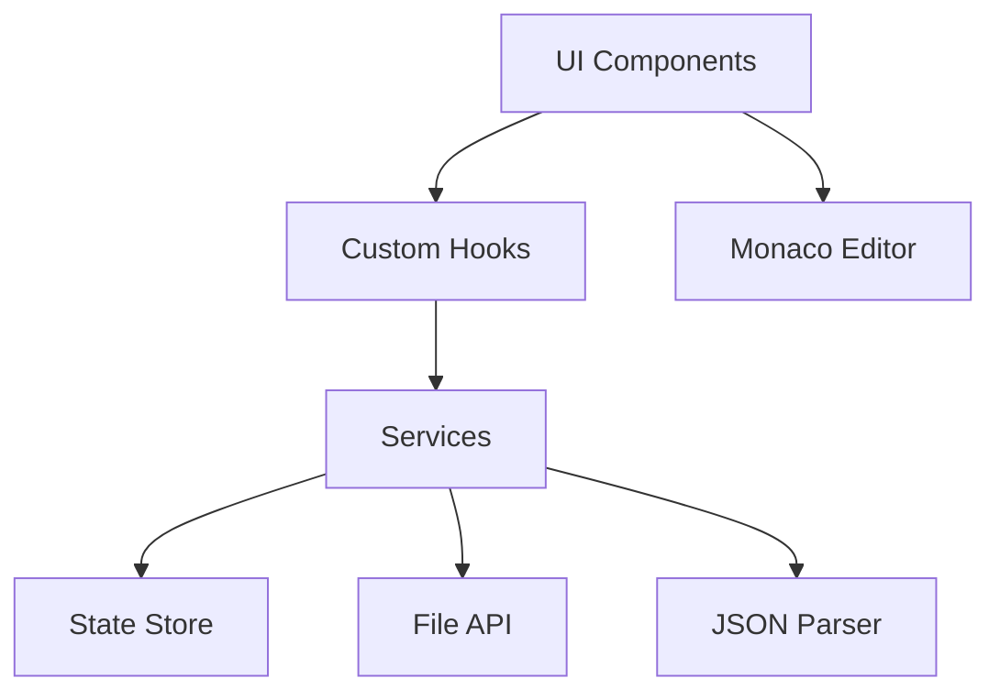

# 设计文档

## 概述

现代化JSON编辑器将构建为一个基于Preact和TypeScript的单页Web应用程序。应用将使用Monaco Editor作为核心编辑器组件，提供类似VS Code的编辑体验，同时集成自定义的JSON验证、格式化和文件管理功能。选择Preact而非React是为了减小应用体积，提高加载速度和运行性能。

## 架构

### 技术栈
- **前端框架**: Preact 10 + TypeScript
- **编辑器核心**: Monaco Editor
- **构建工具**: Vite
- **样式方案**: Tailwind CSS
- **状态管理**: Preact Signals 或 Zustand
- **JSON处理**: 原生JSON + jsonc-parser
- **文件处理**: File API + FileSaver.js

### 架构模式
采用分层架构模式：
- **表现层**: Preact组件和UI交互
- **业务逻辑层**: 自定义Hooks和服务类
- **数据层**: 状态管理和本地存储



## 组件和接口

### 核心组件结构

```
src/
├── components/
│   ├── Editor/
│   │   ├── JsonEditor.tsx          # 主编辑器组件
│   │   ├── EditorToolbar.tsx       # 工具栏
│   │   └── StatusBar.tsx           # 状态栏
│   ├── FileManager/
│   │   ├── FileOperations.tsx      # 文件操作按钮
│   │   └── FileDropZone.tsx        # 拖拽上传区域
│   ├── SearchReplace/
│   │   └── SearchPanel.tsx         # 搜索替换面板
│   └── Settings/
│       └── ThemeSelector.tsx       # 主题选择器
├── hooks/
│   ├── useJsonEditor.ts            # 编辑器状态管理
│   ├── useFileOperations.ts        # 文件操作逻辑
│   └── useJsonValidation.ts        # JSON验证逻辑
├── services/
│   ├── jsonService.ts              # JSON处理服务
│   ├── fileService.ts              # 文件操作服务
│   └── validationService.ts        # 验证服务
├── store/
│   └── editorStore.ts              # 全局状态管理
└── types/
    └── editor.types.ts             # TypeScript类型定义
```

### 主要接口定义

```typescript
// 编辑器状态接口
interface EditorState {
  content: string;
  isValid: boolean;
  errors: JsonError[];
  isDirty: boolean;
  currentFile: FileInfo | null;
  theme: 'light' | 'dark';
  settings: EditorSettings;
}

// JSON错误接口
interface JsonError {
  line: number;
  column: number;
  message: string;
  severity: 'error' | 'warning';
}

// 文件信息接口
interface FileInfo {
  name: string;
  size: number;
  lastModified: Date;
  content: string;
}

// 编辑器设置接口
interface EditorSettings {
  indentSize: 2 | 4;
  indentType: 'spaces' | 'tabs';
  wordWrap: boolean;
  lineNumbers: boolean;
  minimap: boolean;
}
```

## 数据模型

### 状态管理模型

使用Preact Signals或Zustand进行状态管理：

```typescript
// 使用Preact Signals
import { signal, computed } from '@preact/signals';

// 创建状态信号
const content = signal('');
const errors = signal<JsonError[]>([]);
const currentFile = signal<FileInfo | null>(null);
const theme = signal<'light' | 'dark'>('light');

// 计算属性
const isValid = computed(() => errors.value.length === 0);
const isDirty = computed(() =>
  currentFile.value ? content.value !== currentFile.value.content : false
);

// 或使用Zustand
import create from 'zustand';

const useEditorStore = create<EditorState & EditorActions>((set, get) => ({
  content: '',
  errors: [],
  isValid: true,
  isDirty: false,
  currentFile: null,
  theme: 'light',
  settings: {
    indentSize: 2,
    indentType: 'spaces',
    wordWrap: false,
    lineNumbers: true,
    minimap: true,
  },
  setContent: (content) => set({ content, isDirty: true }),
  setErrors: (errors) => set({ errors, isValid: errors.length === 0 }),
  setFile: (file) => set({ currentFile: file, isDirty: false }),
  setTheme: (theme) => set({ theme }),
}));
```

### 本地存储模型

```typescript
// 本地存储的数据结构
interface StoredData {
  settings: EditorSettings;
  theme: 'light' | 'dark';
  recentFiles: FileInfo[];
  lastContent: string;
}

// 本地存储服务
const storageService = {
  saveSettings(settings: EditorSettings): void {
    localStorage.setItem('settings', JSON.stringify(settings));
  },

  getSettings(): EditorSettings | null {
    const data = localStorage.getItem('settings');
    return data ? JSON.parse(data) : null;
  },

  // 其他存储方法...
};
```

## 错误处理

### 错误分类和处理策略

1. **JSON语法错误**
   - 实时解析和验证
   - 在编辑器中显示错误标记
   - 状态栏显示错误摘要

2. **文件操作错误**
   - 文件读取失败：显示错误提示，保持当前内容
   - 文件保存失败：重试机制，提示用户手动保存
   - 文件格式错误：警告用户并尝试解析

3. **应用程序错误**
   - 使用错误边界捕获组件错误
   - 提供错误恢复机制
   - 记录错误日志用于调试

### 错误处理实现

```typescript
// 错误处理服务
class ErrorHandler {
  static handleJsonError(error: SyntaxError): JsonError[] {
    // 解析JSON错误并转换为编辑器标记
    const message = error.message;
    const match = /at position (\d+)/.exec(message);
    if (match) {
      const position = parseInt(match[1], 10);
      // 计算行号和列号
      // ...
      return [{
        line: lineNumber,
        column: columnNumber,
        message: error.message,
        severity: 'error'
      }];
    }
    return [];
  }

  static handleFileError(error: Error): void {
    // 处理文件操作错误
    console.error('File operation error:', error);
    // 显示错误通知
  }

  static handleAppError(error: Error): void {
    // 处理应用程序级错误
    console.error('Application error:', error);
    // 显示错误通知
  }
}

// 错误边界组件
import { Component } from 'preact';

class ErrorBoundary extends Component {
  state = { hasError: false, error: null };

  static getDerivedStateFromError(error) {
    return { hasError: true, error };
  }

  componentDidCatch(error, info) {
    ErrorHandler.handleAppError(error);
    console.error('Error caught by boundary:', info);
  }

  render() {
    if (this.state.hasError) {
      return (
        <div className="error-boundary">
          <h2>Something went wrong</h2>
          <button onClick={() => this.setState({ hasError: false })}>
            Try again
          </button>
        </div>
      );
    }
    return this.props.children;
  }
}
```

## 测试策略

### 测试层次

1. **单元测试**
   - 使用Jest + Testing Library
   - 测试所有自定义Hooks
   - 测试服务类的核心逻辑
   - 覆盖率目标：90%+

2. **集成测试**
   - 测试组件间交互
   - 测试文件操作流程
   - 测试JSON验证和格式化

3. **端到端测试**
   - 使用Playwright或Cypress
   - 测试完整的用户工作流程
   - 测试文件拖拽和保存功能

### 测试用例示例

```typescript
// Hook测试示例
import { renderHook } from '@testing-library/preact-hooks';
import { useJsonValidation } from '../hooks/useJsonValidation';

describe('useJsonValidation', () => {
  it('should validate valid JSON', () => {
    const { result } = renderHook(() => useJsonValidation());
    const errors = result.current.validate('{"key": "value"}');
    expect(errors).toHaveLength(0);
  });

  it('should detect syntax errors', () => {
    const { result } = renderHook(() => useJsonValidation());
    const errors = result.current.validate('{"key": value}');
    expect(errors).toHaveLength(1);
    expect(errors[0].message).toContain('Unexpected token');
  });
});
```

### 性能测试

1. **大文件处理测试**
   - 测试1MB+的JSON文件加载性能
   - 验证编辑器响应性
   - 内存使用监控

2. **实时验证性能**
   - 测试输入延迟和验证响应时间
   - 优化防抖策略

3. **应用体积和加载性能**
   - 监控构建体积
   - 测量首次加载时间
   - 优化代码分割和懒加载

## 用户体验设计

### 界面布局

```
┌─────────────────────────────────────────────────────────┐
│ Header: Logo | File Operations | Theme Toggle           │
├─────────────────────────────────────────────────────────┤
│ Toolbar: Format | Validate | Search | Settings         │
├─────────────────────────────────────────────────────────┤
│                                                         │
│                Monaco Editor                            │
│                (Main Content Area)                      │
│                                                         │
├─────────────────────────────────────────────────────────┤
│ Status Bar: Validation Status | Cursor Position | Size │
└─────────────────────────────────────────────────────────┘
```

### 视觉语言

#### 配色体系

采用「主色+辅助色+中性色」三色模型，使用低饱和度的莫兰迪色系：

1. **主色系**
   - 主色：#3B82F6（蓝色）
   - 主色浅色：#93C5FD
   - 主色深色：#1D4ED8
   - 用途：核心操作按钮、关键信息高亮

2. **辅助色系**
   - 成功色：#10B981（绿色）
   - 警告色：#F59E0B（橙色）
   - 错误色：#EF4444（红色）
   - 用途：状态反馈、功能区分

3. **中性色系**
   - 浅色模式：
     - 背景：#FFFFFF / #F9FAFB
     - 文本：#111827（主文本）/ #6B7280（次要文本）
     - 边框：#E5E7EB
   - 深色模式：
     - 背景：#1F2937 / #111827
     - 文本：#F9FAFB（主文本）/ #9CA3AF（次要文本）
     - 边框：#374151

#### 布局结构

遵循「内容优先」原则：

- 使用CSS Grid和Flexbox实现响应式布局
- 关键信息（编辑器）占据视口中心区域
- 工具栏和状态栏保持紧凑设计
- 留白比例30%-40%，提升界面呼吸感
- 使用8px网格系统，所有间距为8px的倍数

#### 字体与排版

- **字体家族**：Inter（主要）/ Roboto（备选）/ 系统无衬线字体（后备）
- **字号层级**：
  - 大标题：24px（1.5rem）
  - 小标题：18px（1.125rem）
  - 正文：16px（1rem）
  - 辅助文字：14px（0.875rem）
  - 小文本：12px（0.75rem）
- **行高**：1.5-1.75倍字号
- **字重**：Regular(400)、Medium(500)、SemiBold(600)
- **文字对比度**：符合WCAG 2.1 AA标准（≥4.5:1）

#### 图形元素

- **图标**：使用线性图标，统一24x24网格，2px线宽
- **按钮**：
  - 圆角：8px
  - 内边距：水平12px，垂直8px
  - 微投影：2px柔和阴影（仅浅色模式）
  - 状态变化：悬停时轻微缩放（1.02倍）
  - 禁用状态：30%透明度

### 响应式设计

- **桌面端** (>1024px):
  - 完整功能布局
  - 编辑器占据主要空间
  - 工具栏水平排列

- **平板端** (768px-1024px):
  - 简化工具栏，保持核心功能
  - 部分功能折叠到下拉菜单
  - 编辑器区域稍微缩小

- **移动端** (<768px):
  - 垂直布局
  - 工具栏可折叠
  - 隐藏非必要功能
  - 触控目标最小尺寸48x48px

### 交互逻辑

#### 动效设计

- 仅在关键交互节点添加微交互动画：
  - 按钮点击：50ms按压缩放效果
  - 卡片悬停：100ms阴影变化
  - 面板切换：150ms淡入淡出
- 使用CSS Transition实现简单过渡
- 避免复杂动画干扰核心操作

#### 状态反馈

- **加载状态**：使用骨架屏替代传统Loading圈
- **错误提示**：图标+简短文案+操作按钮组合
- **成功反馈**：2-3秒轻提示（Toast）
- **空状态**：提供明确的引导信息和操作建议

#### 输入体验

- **表单输入框**：采用浮动标签设计
- **必填项**：使用红色星号标注
- **错误校验**：输入后延迟300ms校验，避免频繁提示
- **自动完成**：支持常用输入的自动完成

### 无障碍设计

- **键盘导航**：完整的Tab键导航支持，焦点状态明显
- **屏幕阅读器**：所有交互元素添加aria属性
- **颜色对比度**：关键文字达到WCAG 2.1 AAA标准（≥7:1）
- **替代文本**：所有非装饰性图像提供alt文本
- **减少动画**：尊重用户的减少动画设置（prefers-reduced-motion）

### 主题设计

1. **浅色主题**
   - 背景：#FFFFFF / #F9FAFB
   - 编辑器背景：#FFFFFF
   - 文本：#111827
   - 强调色：#3B82F6
   - 卡片/面板：#FFFFFF + 微投影

2. **深色主题**
   - 背景：#1F2937 / #111827
   - 编辑器背景：#1E1E1E
   - 文本：#F9FAFB
   - 强调色：#60A5FA
   - 卡片/面板：#1F2937 + 1px边框

## Monaco Editor 功能集成

### 核心功能利用

1. **代码折叠**
   - 启用内置的代码折叠功能
   - 自定义折叠策略，优化JSON结构展示
   - 添加折叠控制按钮（全部折叠/展开）

2. **智能编辑**
   - 配置括号匹配和自动闭合
   - 启用多光标编辑和列选择模式
   - 配置自动缩进和格式化

3. **导航与搜索**
   - 启用缩略图导航
   - 集成内置搜索/替换功能
   - 配置正则表达式搜索支持

4. **高级功能**
   - 实现基于JSON Schema的自动完成
   - 配置悬停提示和上下文信息
   - 启用差异对比视图

### Monaco Editor 配置

```typescript
// Monaco Editor配置示例
const editorOptions = {
  // 基本设置
  language: 'json',
  theme: currentTheme,
  automaticLayout: true,

  // 代码折叠
  folding: true,
  foldingStrategy: 'indentation',
  foldingHighlight: true,
  showFoldingControls: 'always',

  // 智能编辑
  autoClosingBrackets: 'always',
  autoIndent: 'full',
  formatOnPaste: true,
  formatOnType: false,

  // 导航与搜索
  minimap: {
    enabled: true,
    showSlider: 'always',
    renderCharacters: true
  },
  find: {
    addExtraSpaceOnTop: false,
    autoFindInSelection: 'never',
    seedSearchStringFromSelection: 'always'
  },

  // 性能优化
  largeFileOptimizations: true,

  // 可访问性
  accessibilitySupport: 'auto',

  // 外观
  lineNumbers: 'on',
  renderLineHighlight: 'all',
  roundedSelection: true,
  scrollBeyondLastLine: false
};
```

## 性能优化策略

### 应用体积优化

1. **使用Preact替代React**
   - Preact体积约为React的1/10
   - 保持与React相似的API，便于开发

2. **代码分割和懒加载**
   - 使用动态import()加载非核心功能
   - 将Monaco Editor作为单独的chunk加载

3. **资源优化**
   - 压缩和优化CSS和JavaScript
   - 使用现代图像格式和适当的图像尺寸
   - 实施缓存策略

### 运行时性能优化

1. **虚拟化长列表**
   - 对于大型JSON对象的树视图，使用虚拟化渲染

2. **防抖和节流**
   - 对输入验证和搜索应用防抖
   - 对滚动事件应用节流

3. **Web Workers**
   - 将大型JSON解析和格式化操作移至Web Worker
   - 保持UI线程响应性

4. **内存管理**
   - 避免闭包导致的内存泄漏
   - 适当清理大型对象引用
   - 监控内存使用情况