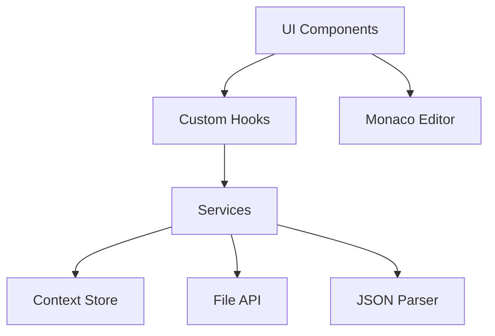

# 设计文档

## 概述

现代化JSON编辑器将构建为一个基于React和TypeScript的单页Web应用程序。应用将使用Monaco Editor作为核心编辑器组件，提供类似VS Code的编辑体验，同时集成自定义的JSON验证、格式化和文件管理功能。

## 架构

### 技术栈
- **前端框架**: React 18 + TypeScript
- **编辑器核心**: Monaco Editor
- **构建工具**: Vite
- **样式方案**: Tailwind CSS + CSS Modules
- **状态管理**: React Context + useReducer
- **JSON处理**: 原生JSON + jsonc-parser
- **文件处理**: File API + FileSaver.js

### 架构模式
采用分层架构模式：
- **表现层**: React组件和UI交互
- **业务逻辑层**: 自定义Hooks和服务类
- **数据层**: Context状态管理和本地存储



## 组件和接口

### 核心组件结构

```
src/
├── components/
│   ├── Editor/
│   │   ├── JsonEditor.tsx          # 主编辑器组件
│   │   ├── EditorToolbar.tsx       # 工具栏
│   │   └── StatusBar.tsx           # 状态栏
│   ├── FileManager/
│   │   ├── FileOperations.tsx      # 文件操作按钮
│   │   └── FileDropZone.tsx        # 拖拽上传区域
│   ├── SearchReplace/
│   │   └── SearchPanel.tsx         # 搜索替换面板
│   └── Settings/
│       └── ThemeSelector.tsx       # 主题选择器
├── hooks/
│   ├── useJsonEditor.ts            # 编辑器状态管理
│   ├── useFileOperations.ts        # 文件操作逻辑
│   └── useJsonValidation.ts        # JSON验证逻辑
├── services/
│   ├── jsonService.ts              # JSON处理服务
│   ├── fileService.ts              # 文件操作服务
│   └── validationService.ts        # 验证服务
├── context/
│   └── EditorContext.tsx           # 全局状态管理
└── types/
    └── editor.types.ts             # TypeScript类型定义
```

### 主要接口定义

```typescript
// 编辑器状态接口
interface EditorState {
  content: string;
  isValid: boolean;
  errors: JsonError[];
  isDirty: boolean;
  currentFile: FileInfo | null;
  theme: 'light' | 'dark';
  settings: EditorSettings;
}

// JSON错误接口
interface JsonError {
  line: number;
  column: number;
  message: string;
  severity: 'error' | 'warning';
}

// 文件信息接口
interface FileInfo {
  name: string;
  size: number;
  lastModified: Date;
  content: string;
}

// 编辑器设置接口
interface EditorSettings {
  indentSize: 2 | 4;
  indentType: 'spaces' | 'tabs';
  wordWrap: boolean;
  lineNumbers: boolean;
  minimap: boolean;
}
```

## 数据模型

### 状态管理模型

```typescript
// 全局状态结构
interface AppState {
  editor: EditorState;
  ui: {
    showSearchPanel: boolean;
    showSettings: boolean;
    sidebarCollapsed: boolean;
  };
  recent: FileInfo[];
}

// Action类型定义
type EditorAction = 
  | { type: 'SET_CONTENT'; payload: string }
  | { type: 'SET_VALIDATION_ERRORS'; payload: JsonError[] }
  | { type: 'SET_FILE'; payload: FileInfo | null }
  | { type: 'SET_THEME'; payload: 'light' | 'dark' }
  | { type: 'UPDATE_SETTINGS'; payload: Partial<EditorSettings> }
  | { type: 'TOGGLE_SEARCH_PANEL' }
  | { type: 'SET_DIRTY'; payload: boolean };
```

### 本地存储模型

```typescript
// 本地存储的数据结构
interface StoredData {
  settings: EditorSettings;
  theme: 'light' | 'dark';
  recentFiles: FileInfo[];
  lastContent: string;
}
```

## 错误处理

### 错误分类和处理策略

1. **JSON语法错误**
   - 实时解析和验证
   - 在编辑器中显示错误标记
   - 状态栏显示错误摘要

2. **文件操作错误**
   - 文件读取失败：显示错误提示，保持当前内容
   - 文件保存失败：重试机制，提示用户手动保存
   - 文件格式错误：警告用户并尝试解析

3. **应用程序错误**
   - 使用React Error Boundary捕获组件错误
   - 提供错误恢复机制
   - 记录错误日志用于调试

### 错误处理实现

```typescript
// 错误处理服务
class ErrorHandler {
  static handleJsonError(error: SyntaxError): JsonError[] {
    // 解析JSON错误并转换为编辑器标记
  }
  
  static handleFileError(error: Error): void {
    // 处理文件操作错误
  }
  
  static handleAppError(error: Error): void {
    // 处理应用程序级错误
  }
}
```

## 测试策略

### 测试层次

1. **单元测试**
   - 使用Jest + React Testing Library
   - 测试所有自定义Hooks
   - 测试服务类的核心逻辑
   - 覆盖率目标：90%+

2. **集成测试**
   - 测试组件间交互
   - 测试文件操作流程
   - 测试JSON验证和格式化

3. **端到端测试**
   - 使用Playwright或Cypress
   - 测试完整的用户工作流程
   - 测试文件拖拽和保存功能

### 测试用例示例

```typescript
// Hook测试示例
describe('useJsonValidation', () => {
  it('should validate valid JSON', () => {
    const { result } = renderHook(() => useJsonValidation());
    const errors = result.current.validate('{"key": "value"}');
    expect(errors).toHaveLength(0);
  });
  
  it('should detect syntax errors', () => {
    const { result } = renderHook(() => useJsonValidation());
    const errors = result.current.validate('{"key": value}');
    expect(errors).toHaveLength(1);
    expect(errors[0].message).toContain('Unexpected token');
  });
});
```

### 性能测试

1. **大文件处理测试**
   - 测试1MB+的JSON文件加载性能
   - 验证编辑器响应性
   - 内存使用监控

2. **实时验证性能**
   - 测试输入延迟和验证响应时间
   - 优化防抖策略

## 用户体验设计

### 界面布局

```
┌─────────────────────────────────────────────────────────┐
│ Header: Logo | File Operations | Theme Toggle           │
├─────────────────────────────────────────────────────────┤
│ Toolbar: Format | Validate | Search | Settings         │
├─────────────────────────────────────────────────────────┤
│                                                         │
│                Monaco Editor                            │
│                (Main Content Area)                      │
│                                                         │
├─────────────────────────────────────────────────────────┤
│ Status Bar: Validation Status | Cursor Position | Size │
└─────────────────────────────────────────────────────────┘
```

### 响应式设计

- **桌面端** (>1024px): 完整功能布局
- **平板端** (768px-1024px): 简化工具栏，保持核心功能
- **移动端** (<768px): 垂直布局，隐藏非必要功能

### 主题设计

1. **浅色主题**
   - 背景：#ffffff
   - 编辑器背景：#fafafa
   - 文本：#333333
   - 强调色：#1890ff

2. **深色主题**
   - 背景：#1e1e1e
   - 编辑器背景：#252526
   - 文本：#d4d4d4
   - 强调色：#007acc

### 交互设计

1. **即时反馈**
   - 输入时实时语法高亮
   - 错误即时显示
   - 操作状态实时更新

2. **快捷操作**
   - 支持常用快捷键
   - 右键上下文菜单
   - 拖拽文件上传

3. **渐进式功能**
   - 核心功能优先显示
   - 高级功能通过设置面板访问
   - 工具提示引导用户